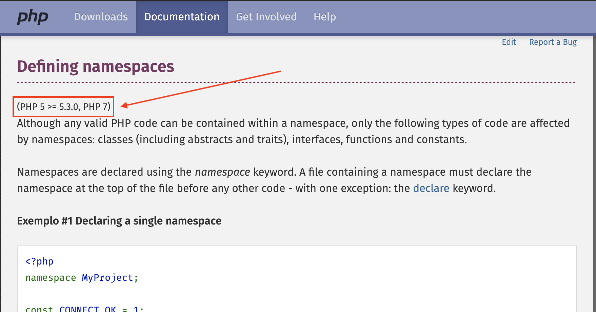

name: capa

.capa-titulo[

# Soluções WEB

]

.capa-subtitulo[

### Prof. Lucas Ferreira

]

---

class: center, middle
count: false

# Backend para Web:<br />Introdução ao PHP

.center[.php-img[]]

---

## Backend

- É a "retaguarda" de sua aplicação/site

- Sistema responsável pela regra de negócios, webservices e APIs de uma aplicação/site

- Normalmente roda em um servidor on-line

- Não deveria rodar diretamente no navegador do usuário (isso é o Frontend)

- Linguagens comuns de backend: Java, PHP, ASP.NET, C#.NET, Python, Go, Ruby, Node.JS, Elixir e etc

---

## PHP

- PHP _(acrônimo recursivo para "PHP - Hypertext Preprocessor")_

- É uma linguagem de interpretação, usada originalmente em aplicações web que atuam no lado do servidor

- Criado por _Rasmus Lerdorf_ em 1994 e lançada em 1995 dentro de uma pacote de programas chamado _**P**ersonal **H**ome **P**age Tools_

- Só veio a ganhar popularidade real com o lançamento da **versão 4.x** comandado por _Zeev_ e _Andi Gutmans_

- Caracterizada com uma linguagem extremamente modularizada, possui ampla aceitação em diversas plataformas e sistemas operacionais

- Atualmente na versão **7.x** com suporte estável também na versão **5.6.x**

---

## Características Principais

- Linguagem veloz e robusta
- Procedural, funcional e também baseada em Orientação a Objetos
- Altamente portável
- Com tipagem dinâmica
- Sintaxe similar ao C/C++, JavaScript e Pearl
- Open-source
- Necessita de um interpretador para rodar _(`php` ou `php.exe`)_

---

## Descobrindo a versão seu PHP

Na pasta de seu servidor crie um arquivo chamado `info.php` com o seguinte conteúdo:

```php
<?php phpinfo(); ?>
```

--

Ou com o executável do PHP no `PATH` de seu sistema operacional, acesse o terminal/prompt e digite:

```bash
php -v
```

---

## Documentação do PHP

O PHP possui uma ótima documentação, com amplo conteúdo em Inglês e também **Português**:

<https://www.php.net/manual/pt_BR/>

--

Fique sempre atento a **versão mínima de suporte** de cada funcionalidade:

.center[.doc-img[]]

---

## Sintaxe Básica

Primeiro ponto a ser destacado é que PHP _(assim como JavaScript)_ é case-sensitive:

```php
<?php
// abaixo temos duas variáveis distintas
$Nome = "Wédley";
$nome = "Clairton";

echo "$Nome e $nome";
?>
```

--

Toda linha declarativa ou evaluativa deve ser **obrigatoriamente** terminada com ponto-e-vírgula _(;)_

--

Todo _script_ PHP deve começar com `<?php` e terminar com `?>`

---

## Declaração de Variáveis

As variáveis em PHP basicamente são declaradas assim:

```php
<?php
$nome = "Lucas";
$sobrenome = "Ferreira";
$idade = 33;
$linguagens = array("JavaScript", "PHP"); // ou ["JavaScript", "PHP"];
?>
```

--

Constantes fora do escopo de uma Classe, devem ser declaradas assim:

```php
<?php
define("STATUS_APROVADO", 10);

echo STATUS_APROVADO;
?>
```

Cada constante só pode ser definida uma vez ao longo de toda execução do script, não pode ser sobrescrita e não deve ser iniciada com cifrão _(`$`)_

--

Para analisar melhor uma variável já declarada utilize a função `var_dump`

---

## Imprimindo valores em tela

Para imprimir o valor de uma variável em tela _(muito útil no mix com HTML)_ o PHP disponibiliza algumas "funções" úteis:

- `echo`
- `print`
- `var_dump` => fins de debug
- `print_r` => para arrays/objetos + fins de debug

--

**Exemplo:**

```php
<?php
$nome = "Lucas";

echo $nome;
?>
```

--

**Exemplo:**

```php
<?php
$linguagens = array("JavaScript", "PHP", "HTML");

print_r($linguagens);
?>
```

---

## Variáveis "Super-Globais" do PHP

Existem algumas variáveis que já vem de fábrica e declaradas em todo script PHP:

- `$GLOBALS` => Referencia todas as variáveis em escopo global _(fora de funções e classes)_
- `$_SERVER` => Um array do tipo chave-valor contendo diversas informações úteis
- `$_GET` => Variáveis passadas na URL em uma requisição
- `$_POST` => Variáveis enviadas via formulário em uma requisição do tipo POST
- `$_FILES` => Arquivos enviados em um formulário com **upload**
- `$_COOKIE` => Registro de cookies da aplicação
- `$_SESSION` => Registro de variáveis da sessão da aplicação
- `$_REQUEST` => Um grande array que mescla os valores de `$_GET`, `$_POST` e `$_COOKIE`

---

## Array _(Matriz)_

Criar arrays _(matrizes)_ em PHP é muito simples:

```php
<?php
$linguagens = array("JavaScript", "PHP", "HTML", "CSS");
$idades = array(21, 23, 25, 24);
?>
```

--

O acesso a estes valores se dá por meio de sua posição-índice, começando sempre em _zero_:

```php
<?php
echo $linguagens[0];
echo $linguagens[1];
echo $idades[0];
?>
```

---

## Array _(Dicionário)_

Outra característica na flexibilidade do uso de arrays em PHP são os chamados "arrays associativos":

```php
<?php
$usuario = array(
  "nome" => "Lucas",
  "idade" => 33,
  "email" => "lucas.ferreira@satc.edu.br",
  "linguagens" => array("JavaScript", "PHP", "HTML", "CSS")
);

// exibindo o nome do usuário
echo $usuário["nome"];
?>
```

--

O operador de associação de chave => valor em PHP é a seta dupla **=>**.

---

## Funções para manipulação de Arrays:

A maioria das funções úteis para se trabalhar com Arrays começam com `array_*`:

- `array_push`
- `array_splice`
- `array_slice`
- `array_keys`
- `array_map`
- `array_reduce`
- `array_unique`

--

e também:

- `sort`
- `end`
- `current`
- `extract`
- `in_array`
- `count`

---

## Declaração em bloco

Uma declaração em bloco é utilizada para agrupar declarações.
O bloco é delimitado por um par de chaves:

```php
{
  declaracao_1;
  declaracao_2;
  .
  .
  .
  declaracao_n;
}
```

Servem para if, else, for, while, function e etc

---

## Declarações condicionais

```php
if (condicao) {
  declaracao_1;
} else if (condicao_2) {
  declaracao_2;
} else if (condicao_n) {
  declaracao_n;
} else {
  declaracao_final;
}
```

--

Em PHP tanto faz usar `else if` ou `elseif`

---

## Declaração switch

```php
switch (expressao) {
  case rotulo_1:
    declaracoes_1
    [break;]
  case rotulo_2:
    declaracoes_2
    [break;]
    ...
  default:
    declaracoes_padrao
    [break;]
}
```

---

## Estruturas de Repetição (loop)

```php
<?php
for ($passo = 0; $passo < 5; $passo++) {
  echo "<p>Andou {$passo} passos</p>";
}
```

--

```php
<?php
$passo = 0;
while ($passo < 5) {
  echo "<p>Andou {$passo} passos</p>";
  $passo++;
}
```

--

Use break para parar a execução de um loop ou continue para pular para o próximo passo

---

## Declaração de Funções

A definição da função (também chamada de declaração de função) consiste no uso da palavra chave function, seguida por:

- Nome da Função.
- Lista de argumentos para a função, entre parênteses e separados por vírgulas.
- Declarações PHP que definem a função, entre chaves { }.

--

```php
function square($numero) {
  return $numero * $numero;
}
```

--

```php
echo square(5); // 25
```

--

As variáveis definidas no interior de uma função não podem ser acessadas de nenhum lugar fora da função, porque a variável está definida apenas no escopo da função.

---

## Definições de Classes (OOP)

O conceito real de OOP foi oficializado na _versão 5.0 do PHP_.

Para definir uma classe em PHP pode-se fazer assim:

```php
<?php
class SimpleClass
{
    // declaração de propriedade
    public $var = 'um valor padrão';

    // declaração de método
    public function displayVar() {
        echo $this->var;
    }
}
?>
```

Podemos usar `extends`, `interface`, `implements`, variáveis e métodos `static`, `private`, `public` e `protected` como qualquer outra linguagem orientada a objetos.

--

A auto referência de uma classe já instanciada fica no elemento `$this`, sendo que métodos estáticos podem ficar acessíveis com `self` ou o nome da própria classe.

---

## Definições de Classes (OOP)

Para instancia uma classe em PHP utilizamos o operador `new`:

```php
<?php
$simpleObj = new SimpleClass();
$simpleObj->displayVar();
```

Em PHP chamamos um método associado à uma classe com operador de objetos **->**, ou seja se em Java fazemos assim:

`meuObjeto.meuMetodo();`

Em PHP faremos assim:

`meuObjeto->meuMetodo();`

--

Por fim, métodos estáticos são chamado com dois pontos seguidos de dois pontos, assim `SimpleClass::myStaticMethod()`.

--

**A grande maioria dos frameworks PHP utilizam muito OOP em seus métodos de trabalho.**

---

## `include`, `require` e `require_once`

O PHP facilita muito o reaproveitamento de arquivos, organização desacoplada e também conceitos de `DRY`.

Você pode separar a lógica de sua aplicação em diversos arquivos e importá-los ao longo de seu uso e necessidade, utilizando as seguintes funções:

- `include` => inclui um arquivo de forma livre, não interrompe a execução se o arquivo não for encontrado

--

- `require` => inclui um arquivo de forma obrigatória, interrompe a execução se o arquivo não for encontrado

--

- `require_once` => inclui um arquivo de forma obrigatória e única, o mesmo arquivo não poderá ser incluido mais de uma vez ao longo da mesma execução, interrompe a execução se o arquivo não for encontrado

---

## Extensões de PHP

O PHP é escrito em C _(assim como Python, Ruby e outras linguagens)_ e têm uma característica interessante de ser extensível em suas características. Novos "trechos de código e funcionalidade" podem ser carregados e anexados ao runtime do PHP agregando novas características ao mesmo.

--

As extensões mais utilizadas do PHP são:

- `PDO` - Banco de dados diversos de forma escalável
- `APC` - Cache de aplicação
- Suporte individual a bancos diversos
- `GD2` - Manipulação de Imagens
- `SOAP` - Webservices em SOAP
- `XML` - Manipulação de XML

---

## Conexão com Banco de Dados

O PHP suporta diversos bancos de dados: `Oracle`, `Sybase`, `PostgreSQL`, `InterBase`, `MySQL`, `SQLite`, `MSSQL`, `Firebird` e entre outros.

Grande maioria precisa ter extensões devidamente instaladas, habilitadas e configuradas para que o PHP consiga conectar nos bancos.

---

## MySQL - Clássico

Cada banco de dados que esteja devidamente configurado no PHP (mediante a ativação de sua extensão) costuma ter suas funções próprias.

No caso do MySQL clássico são identificadas como `mysql_*` desde versões pré-históricas da linguagem.

Na versão 5.x do PHP essa extensão de conexão com MySQL fora reescrita e chamada de **MySQLi**. Possuindo todos os mesmos métodos e funcionalidades da finada `mysql_*` as funções `mysqli_*` são as únicas suportadas no PHP 7.x.

---

## MySQL - Clássico

Script básico de conexão com MySQL:

```php
<?php
$conexao = mysqli_connect("localhost", "root", "123456", "satc");

if(!$conexao) {
  echo "ERRO: Não foi possível conectar em seu banco de dados";
  exit;
}

// se chegarmos até aqui é sucesso!
?>
```

---

## MySQL - Clássico

Podemos então resgatar alguns dados da tabela `alunos`:

```php
$query = mysqli_query($conexao, "SELECT * FROM alunos", $conexao);

if (!$query) {
  echo 'Invalid query: ' . mysqli_error($conexao) . "\n";
  exit;
}

// se chegarmos até aqui é sucesso!
while ($row = mysqli_fetch_assoc($query)) {
    echo $row['nome'] . "<br />";
}
```

--

E não podemos esquecer de fechar nossa conexão com o banco _(para liberar memória)_:

```php
<?php
mysqli_close($conexao);
?>
```

---

## PDO

**PDO** significa PHP Data Objects _(Objetos de Dados do PHP)_.

É uma classe para gerenciar conexões com bancos de dados, sendo possível usar PDO para conectar com diversos SGBDs, dentre eles MySQL, PostreSQL, SQLite, MS SQL Server, Oracle e outros.

--

A classe PDO visa substituir o uso individual das extensões exclusivas de cada banco junto ao PHP, além de facilitar a migração de um banco de dados para outro em uma aplicação já desenvolvida.

--

Para utilizar PDO em seu projeto você precisará da extensão `PDO` compilada e instalada em seu PHP, junto das extensões particulares de cada banco como a `PDO_MYSQL`.

---

## PDO

Script básico de conexão com MySQL **utilizando PDO**:

```php
<?php
try {

  $conn = new PDO('mysql:host=localhost;dbname=satc', "root", "123456");

} catch(PDOException $err) {

  echo 'Erro ao conectar com o MySQL: ' . $err->getMessage();
  exit;

}
?>
```

---

## PDO

Podemos então resgatar alguns dados da tabela `alunos`:

```php
$query = $conn->query("SELECT * FROM alunos");
$rows = $query->fetchAll(PDO::FETCH_ASSOC);

foreach($rows as $row) {
  echo $row['nome'] . "<br />";
}
```

--

OU com _Prepared Statements_:

```php
$search = '%silva%';

$stmt = $conn->prepare("SELECT * FROM alunos WHERE nome LIKE :search");
$stmt->bindParam( ':search', $search );
$stmt->execute();

$rows = $stmt->fetchAll(PDO::FETCH_ASSOC);
foreach($rows as $row) {
  echo $row['nome'] . "<br />";
}
```

---

## autoload, namespace, composer e projetos modernos

Ao longo dos anos e suas versões o PHP vêm evoluindo constantemente, principalmente buscando aumentar sua performance, seu conjunto de ferramentas e continuar sendo relevante no mercado profissional de desenvolvimento web.

Algumas funcionalidades agregaram em muito para que o PHP não perdesse seu espaço no mercado, funcionalidades que vieram a surgir a partir da **versão 5.3** do PHP em diante:

- `autoload`
- `namespace`
- `composer`

--

Mas o detalhamento destes tópicos **ficarão para a próxima aula**, dado que seu uso junto aos frameworks PHP ficam mais fáceis de entender ;)

---

class: center, middle

.center[.gif-img[]]
